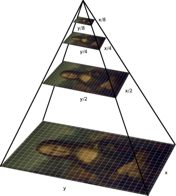

Môn: CS114.K21
# Machine Learning Capstone: Phát hiện và phân loại biển báo giao thông phổ biến trong Làng Đại học
# Tổng quan
Ngày nay, cơ sở hạ tầng giao thông ngày càng phát triển, việc phát hiện biển báo để cung cấp thông tin đến người tham gia giao thông là một điều rất quan trọng. Tận dụng những kiến thức đã được học ở môn Machine Learning, kết hợp với những điều gần gũi với đời sống. Nhóm chúng em đã chọn đề tài “Phát hiện các loại biển báo giao thông phổ biến ở Làng Đại học” làm đề tài nghiên cứu. Giúp mọi người có thể hiểu đâu là biển báo giao thông và chúng có ý nghĩa thế nào.

- Mô tả bài toán:
  - Input: Một bức ảnh có chứa biển báo bất kỳ.
  - Output: Ảnh input với bounding box khoanh vùng có biển báo và tên biển báo

Để xây dựng được mô hình như yêu cầu bài toán đó, ta cần phải trải qua 2 bước:
- Tìm biển báo(*).
- Phân loại biển báo(* *).
# - Phát hiện biển báo:
- Quét bức ảnh input bằng một cửa sổ trượt từ trái sang phải và từ trên xuống dưới.
- Trích xuất đặc trưng ở mỗi vùng scan qua trên hình.
- Sử dụng model phân loại biển báo(* *) để dựng đoán xem vùng đó có chứa biển báo hay không.
- Tổng hợp lại các vùng có chứa biển báo thỏa mãn để có một vùng duy nhất (Final bounding boxes)
# Xây dựng Scanner
Để có thể tìm được vật thể chúng ta cần tìm, ta cần phải quét toàn bộ trên bức hình. Vì vật thể có thể nằm bất cứ đâu trên hình và có kích thước ngẫu nhiên. Cho nên chúng ta cần xây dụng “scanner” theo 2 tiêu chí sau:

- Kích thước ảnh quét: Ta cần phải quét trên bức ảnh với nhiều kích thước khác nhau để có thể tìm ra được vật thể. Gọi tắt là kỹ thuật “Image Pyramid”.

- Phạm vi quét: Ta cần phải quét phạm vi toàn bức ảnh. Cho nên cần xây dựng một cửa sổ trượt để quét lần lượt toàn bộ bức ảnh theo chiều từ trên xuống và trái sang phải.(Sliding window)

# Trích xuất đặc trưng ở mỗi vùng scan trên hình:
- Ta sẽ sử dụng HOG((histogram of oriented gradients) để trích xuất đặc trưng trên những vùng mà cửa sổ trượt qua.
HOG là một feature descriptor được sử dụng trong computer vision và xử lý hình ảnh, dùng để detect một đối tượng. Các khái niệm về HOG được nêu ra từ năm 1986 tuy nhiên cho đến năm 2005 HOG mới được sử dụng rộng rãi sau khi Navneet Dalal và Bill Triggs công bố những bổ sung về HOG. HOG tương tự như các biểu đồ edge orientation, scale-invariant feature transform descriptors (như sift, surf ,..), shape contexts nhưng HOG được tính toán trên một lưới dày đặc các cell và chuẩn hóa sự tương phản giữa các block để nâng cao độ chính xác. HOG được sử dụng chủ yếu để mô tả hình dạng và sự xuất hiện của một object trong ảnh.

# Dự đoán đối tượng trong cửa sổ trượt
- Ta sẽ sử dụng một model đã được train về các loại biển báo phổ biến trong làng đại học để dự đoán xem có biển báo trong cửa sổ hay không.

Sau khi dự đoán, nếu có đối tượng biển báo trong hình thì ta sẽ tiến hành trả về tọa độ vị trí của đối tượng.

Model sử dụng trong bài toán này: SVM và KNN

